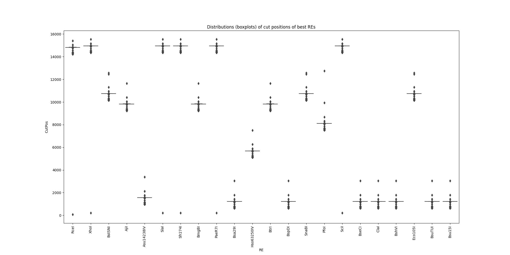

# mt-restrictases

## Task - Search the restrictases (RE) that:
- do **only cut** in human mitochondrial genome
- cut majority of the human population mitochondrial genomes
- cut genome out of D-loop that often contains deletions


## Workflow
### 1 Download human mt genomes from [NCBI](https://www.ncbi.nlm.nih.gov/nuccore/?term=ddbj_embl_genbank%5Bfilter%5D+AND+txid9606%5Borgn%3Anoexp%5D+AND+complete-genome%5Btitle%5D+AND+mitochondrion%5Bfilter%5D) with query to **Nucleotide database**:
```
ddbj_embl_genbank[filter] AND txid9606[orgn:noexp] AND complete-genome[title] AND mitochondrion[filter] 
```
**Downloaded 56445 human mt-genomes**

### 2 Clean up sequences from non human mt genomes (optional, in downloaded sequences there are only human mt-genomes)
```
bash scripts/0.cleanup_sequences.sh SEQS OUT_SEQS
```

### 3.1 Brute force method
Just search the restriction enzymes that do only one cut in human mt-genome in all genomes separately using biopython. As a result we get RE and position of its cut in each genome.

```
python3 bruteforce_search_of_re.py
```
**[Analysis](./nb/EDA_bruteforce.ipynb) in jupyter notebook**


### 3.2 Align genomes to reference and extract conservative sites from multiple alignment (optional) 
```
bash scripts/1.bwa.sh bwa samtools data/share/NC_012920.1.fasta data/raw/sequence.fasta 24

mv data/raw/sequence.fasta.sam data/interim/

perl scripts/2.longest-alignments.pl data/interim/sequence.fasta.sam > data/interim/sequence.fasta.purified.sam

python3 scripts/3.sam2fasta.py data/share/NC_012920.1.fasta data/interim/sequence.fasta.purified.sam data/interim/mulal.fasta
```
**[Analysis](./nb/EDA_mulal.ipynb) in jupyter notebook**

### 4 Look at deletions distribution (optional)
```
egrep -o "\-*" data/interim/mulal.fasta | sort | uniq -c | awk '{print $1 "\t" length($2) "\t" $2 "\t" length($2)%3}' | tee logs/gaps.log
```

## Results of powerful brute force approach
1. Effectivity and applicability (number of genomes cutted once) of restrictases dumped in the file [cuted_seqs_num.csv](data/share/cuted_seqs_num.csv)
2. Graph of found enzymes cut localization:



## Main candidate - **ClaI**
